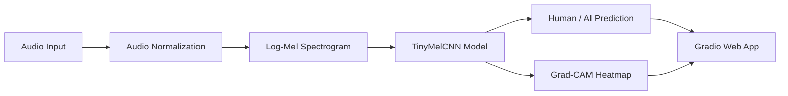

# 🛡️ Voice Guard — Human vs AI Speech Detector

<p align="center">
  <b>Explainable AI voice detection for short speech clips</b><br>
  Classifies audio as <b>Human</b> or <b>AI-generated</b> using log-mel spectrograms, a PyTorch CNN, Grad-CAM explainability, and a Gradio web demo.
</p>

<p align="center">
  <a href="https://huggingface.co/spaces/varunkul/Voice-guard">
    
  </a>
  
  
  
  
</p>

---

## 🚀 Live Demo

Try the deployed app here:

🔗 **[Voice Guard on Hugging Face Spaces](https://huggingface.co/spaces/varunkul/Voice-guard)**

---

## 📌 Project Overview

**Voice Guard** is a hackathon-style machine learning project that detects whether a short speech clip is **human-recorded** or **AI-generated**.

The system takes an uploaded or microphone-recorded audio clip, converts it into a **log-mel spectrogram**, runs it through a lightweight **Convolutional Neural Network**, and returns:

- Probability that the audio is **human speech**
- Probability that the audio is **AI-generated speech**
- Final predicted label: `human` or `ai`
- Grad-CAM spectrogram heatmap showing the audio regions that influenced the model

This project is built as a practical prototype for synthetic speech detection and explainable audio classification.

---

## 👥 Team

| Name | GitHub |
|---|---|
| Hritik Patil | [@Hritik827](https://github.com/Hritik827) |
| Akhilesh Kumbhar | [@akhileshkumbhar05-ui](https://github.com/akhileshkumbhar05-ui) |
| Varun Kulkarni | [@varun-kul](https://github.com/varun-kul) |

---

## 🎯 Project Goal

The goal of this project is to build a lightweight and explainable AI voice detection system that can classify short audio clips into two categories:

```text
0 = human
1 = ai
```

The project follows a complete end-to-end machine learning workflow:



---

## ✨ Key Features

### 🎙️ 1. Human vs AI Speech Classification

The detector accepts a short audio clip and predicts whether the clip is human-recorded or AI-generated.

Example output:

```json
{
  "human": 0.184,
  "ai": 0.816,
  "label": "ai",
  "threshold": 0.5,
  "trained": true
}
```

The model predicts `ai` when the AI probability is greater than or equal to the configured threshold.

---

### 🌐 2. Gradio Web Interface

The project includes a browser-based Gradio app where users can:

- Upload an audio file
- Record audio using a microphone
- Click **Analyze**
- View prediction probabilities
- View the final label
- View a Grad-CAM explanation heatmap
- Run an optional provenance check button

Main app entry point:

```bash
python app/app.py
```

---

### 🔥 3. Grad-CAM Explainability

Instead of returning only a black-box prediction, the model generates a Grad-CAM heatmap over the spectrogram.

The heatmap highlights the time-frequency regions that contributed most strongly to the model prediction.

Implemented in:

```text
app/utils/gradcam.py
```

Called from:

```text
app/inference.py
```

---

### 🤖 4. ElevenLabs AI Speech Generation

The repository includes a script to generate AI speech clips using the ElevenLabs text-to-speech API.

Generation files:

```text
gen_clips.py
app/elevenlabs_tools.py
```

The generation script uses multiple ElevenLabs voices, including:

- Adam
- Alice
- Aria
- Brian
- Bill
- Charlotte
- Clyde
- Drew
- Freya
- Gigi

Generated MP3 files are saved to:

```text
data/raw/ai_mp3/
```

Converted 16 kHz mono WAV files are saved to:

```text
data/raw/ai/
```

---

### 🐳 5. Docker Support

The project includes Docker support for running the Gradio app in a container.

Dockerfile location:

```text
docker/Dockerfile
```

---

## 🧠 How It Works

### Audio Processing Pipeline

Every audio clip goes through the same preprocessing pipeline:

1. Load audio from file path or raw bytes
2. Convert audio to mono
3. Resample audio to 16 kHz
4. Normalize amplitude
5. Pad or trim clip to a fixed duration
6. Convert waveform into a log-mel spectrogram
7. Run the CNN classifier
8. Generate prediction probabilities
9. Generate Grad-CAM heatmap

Important audio settings:

```python
TARGET_SR = 16000
CLIP_DURATION = 3.0
N_MELS = 64
N_FFT = 1024
HOP_LENGTH = 256
FMIN = 20
FMAX = sr // 2
```

---

## 🏗️ Model Architecture

The project uses a compact CNN model called `TinyMelCNN`.

```text
Input: 1 x n_mels x time

Conv2d: 1 -> 16
BatchNorm2d
ReLU
MaxPool2d

Conv2d: 16 -> 32
BatchNorm2d
ReLU
MaxPool2d

Conv2d: 32 -> 64
BatchNorm2d
ReLU
AdaptiveAvgPool2d(8 x 8)

Flatten
Linear: 64*8*8 -> 128
ReLU
Dropout(0.2)
Linear: 128 -> 2
```

Output classes:

```text
0 = human
1 = ai
```

The model checkpoint contains approximately **548k parameters**, making it lightweight enough for fast inference.

---

## 📂 Repository Structure

```text
.
├── README.md
├── requirements.txt
├── .gitignore
├── LICENSE
├── convert.py
├── gen_clips.py
│
├── app/
│   ├── __init__.py
│   ├── app.py
│   ├── inference.py
│   ├── train.py
│   ├── elevenlabs_tools.py
│   │
│   ├── models/
│   │   ├── cnn_melspec.py
│   │   └── weights/
│   │       ├── cnn_melspec.pth
│   │       └── cnn_melspec.last.pth
│   │
│   └── utils/
│       ├── audio.py
│       ├── convert_mp3_to_wav.py
│       └── gradcam.py
│
├── data/
│   └── raw/
│       ├── ai/
│       ├── ai_mp3/
│       └── human/
│
├── human/
│   └── original AAC human recordings
│
├── docker/
│   └── Dockerfile
│
└── notebooks/
    └── 01_error_analysis.ipynb
```

---

## ⚙️ Installation

### 1. Clone the Repository

```bash
git clone https://github.com/Hritik827/Voice-Guard-Human-vs-AI-Speech.git
cd Voice-Guard-Human-vs-AI-Speech
```

---

### 2. Create a Virtual Environment

#### Windows PowerShell

```powershell
python -m venv .venv
.\.venv\Scripts\activate
```

#### Windows Git Bash

```bash
python -m venv .venv
source .venv/Scripts/activate
```

#### macOS / Linux

```bash
python3 -m venv .venv
source .venv/bin/activate
```

---

### 3. Upgrade pip

```bash
python -m pip install --upgrade pip
```

---

### 4. Install Dependencies

```bash
pip install -r requirements.txt
```

---

## 🔐 Environment Variables

Create a `.env` file in the project root only if you want to use ElevenLabs generation or customize inference settings.

Example:

```env
ELEVEN_API_KEY=your_elevenlabs_api_key_here
ELEVEN_VOICE_ID=your_default_voice_id_here

MODEL_WEIGHTS_PATH=app/models/weights/cnn_melspec.pth
DETECTOR_AI_THRESHOLD=0.50
DETECTOR_AI_BIAS=0.00
DETECTOR_ALLOW_HEURISTIC=0
```

> **Important:** Do not commit `.env` to GitHub.

Recommended `.gitignore` entries:

```gitignore
.env
*.env
__pycache__/
*.py[cod]
.venv/
venv/
.ipynb_checkpoints/
.DS_Store
Thumbs.db
```

---

## ▶️ Run the App Locally

From the project root, run:

```bash
python app/app.py
```

Or:

```bash
python -m app.app
```

After running the command, open the local Gradio URL shown in the terminal.

Usually it looks like:

```text
http://127.0.0.1:7860
```

---

## 🧪 Train the Model

Default training command:

```bash
python -m app.train --data_dir data/raw --out app/models/weights/cnn_melspec.pth
```

More complete training command:

```bash
python -m app.train \
  --data_dir data/raw \
  --out app/models/weights/cnn_melspec.pth \
  --epochs 10 \
  --batch_size 32 \
  --grad_accum 2 \
  --lr 1e-3 \
  --val_ratio 0.15 \
  --clip_seconds 3.0 \
  --seed 42
```

For CPU-only training:

```bash
python -m app.train --data_dir data/raw --cpu
```

For Windows multiprocessing issues, use:

```bash
python -m app.train --data_dir data/raw --workers 0
```

---

## 📊 Training Pipeline

The training script performs the following steps:

1. Reads audio files from `data/raw/human` and `data/raw/ai`
2. Assigns labels:
   - `0 = human`
   - `1 = ai`
3. Shuffles the dataset
4. Splits data into training and validation sets
5. Pads or trims each clip to 3 seconds
6. Applies audio augmentation
7. Converts audio into log-mel spectrograms
8. Trains `TinyMelCNN`
9. Saves the latest checkpoint after each epoch
10. Saves the best checkpoint based on validation performance

Saved model files:

```text
app/models/weights/cnn_melspec.pth
app/models/weights/cnn_melspec.last.pth
```

---

## 🎚️ Audio Augmentation

Human clips receive mild natural perturbations:

- Gaussian noise
- Small time stretch
- Small pitch shift
- Gain adjustment

AI clips receive replay-aware augmentation:

- Band-pass filtering
- Gaussian noise
- Time stretch
- Gain adjustment
- Optional clipping distortion
- Optional MP3 compression when supported

These augmentations help the model become more robust to real-world recording conditions such as microphone noise, speaker playback, compression, and replay artifacts.

---

## 🗂️ Dataset

The repository includes a small local dataset.

### AI Speech Data

```text
data/raw/ai/
```

Contains:

```text
200 WAV files
```

Format:

```text
16 kHz mono WAV
```

---

### AI MP3 Source Data

```text
data/raw/ai_mp3/
```

Contains:

```text
200 MP3 files
```

These are the original ElevenLabs-generated MP3 files before WAV conversion.

---

### Human Speech Data

```text
data/raw/human/
```

Contains:

```text
50 WAV files
```

Format:

```text
16 kHz mono WAV
```

---

### Original Human Recordings

```text
human/
```

Contains:

```text
50 AAC files
```

These are original human recordings before conversion into training-ready WAV format.

---

## ⚖️ Dataset Balance

The current dataset is imbalanced:

```text
AI clips:    200
Human clips: 50
```

The training code uses class-weighted cross entropy to reduce the effect of imbalance.

However, because the dataset is small and skewed, this project should be treated as a prototype and not as a production-grade detector.

---

## 🤖 Generate AI Voice Data

To generate AI speech clips with ElevenLabs:

1. Add your ElevenLabs API key to `.env`
2. Run:

```bash
python gen_clips.py
```

The script will:

1. Generate MP3 clips using ElevenLabs
2. Save them to `data/raw/ai_mp3`
3. Convert them to 16 kHz mono WAV files in `data/raw/ai`

---

## 🔄 Convert MP3 to WAV

Use this command to convert MP3 files into 16 kHz mono WAV files:

```bash
python -m app.utils.convert_mp3_to_wav --src data/raw/ai_mp3 --dst data/raw/ai
```

This conversion uses:

- `librosa`
- `soundfile`

---

## 🐳 Run with Docker

### Build the Docker Image

```bash
docker build -f docker/Dockerfile -t voice-guard .
```

### Run the Container

```bash
docker run -p 7860:7860 voice-guard
```

Then open:

```text
http://localhost:7860
```

### Run with Environment Variables

For local testing with a `.env` file:

```bash
docker run --env-file .env -p 7860:7860 voice-guard
```

> Security note: avoid copying `.env` into Docker images for public repositories or shared images. Use runtime environment variables instead.

---

## 🧩 Important Files

| File | Purpose |
|---|---|
| `app/app.py` | Main Gradio web app |
| `app/inference.py` | Model loading, inference, probability output, Grad-CAM call |
| `app/train.py` | Training pipeline |
| `app/models/cnn_melspec.py` | TinyMelCNN model architecture |
| `app/utils/audio.py` | Audio loading, preprocessing, log-mel feature extraction |
| `app/utils/gradcam.py` | Spectrogram Grad-CAM explainability |
| `app/utils/convert_mp3_to_wav.py` | MP3-to-WAV converter |
| `app/elevenlabs_tools.py` | ElevenLabs helper functions |
| `gen_clips.py` | AI speech generation script |
| `convert.py` | File flattening and renaming utility |
| `docker/Dockerfile` | Docker container setup |
| `notebooks/01_error_analysis.ipynb` | Placeholder for future error analysis |

---

## 🧾 Example Prediction Output

```json
{
  "human": 0.23,
  "ai": 0.77,
  "label": "ai",
  "threshold": 0.5,
  "trained": true
}
```

Meaning:

| Field | Description |
|---|---|
| `human` | Probability that the clip is human speech |
| `ai` | Probability that the clip is AI-generated speech |
| `label` | Final predicted class |
| `threshold` | AI decision threshold |
| `trained` | Whether trained model weights were loaded |

---

## 🛠️ Technologies Used

### Machine Learning

- Python
- PyTorch
- TorchAudio
- NumPy
- SciPy
- librosa
- soundfile
- audiomentations

### Model Explainability

- Grad-CAM
- Spectrogram heatmaps
- Matplotlib visualization

### Web App

- Gradio

### API and Environment Tools

- requests
- python-dotenv
- pydantic

### Data Generation

- ElevenLabs text-to-speech API

### Containerization

- Docker
- Python 3.11 slim image

### Development

- Jupyter Notebook
- Black formatter

---

## ⚠️ Known Limitations

This project is a working prototype, but it has important limitations:

1. The dataset is small.
2. The dataset is imbalanced.
3. AI clips are generated mainly from ElevenLabs.
4. The model may overfit to ElevenLabs-style speech.
5. It may not generalize well to other TTS providers.
6. Real-world recordings include more noise, microphones, accents, and compression artifacts.
7. The provenance check button currently calls a stub, not a real external detector.
8. Formal benchmark metrics are not yet included.
9. The error analysis notebook is currently a placeholder.
10. The model should not be used for high-stakes decisions without stronger validation.

---

## 🔮 Future Improvements

Planned or recommended improvements:

- Add more human voices across genders, accents, rooms, devices, and microphones
- Add AI speech from multiple TTS providers
- Add a held-out speaker/provider test split
- Add formal metrics: accuracy, precision, recall, F1, ROC-AUC, EER
- Add confusion matrix and error analysis notebook
- Calibrate model probabilities
- Add support for longer clips using sliding windows
- Add a FastAPI inference endpoint
- Add automated tests for preprocessing and inference
- Add CI checks for formatting and linting
- Use Git LFS for large model weights and audio files
- Add model versioning and dataset versioning

---

## 🔒 Security Notes

Do not commit secrets to GitHub.

The following file should remain local:

```text
.env
```

If an API key is accidentally pushed to GitHub:

1. Revoke the key immediately
2. Generate a new key
3. Remove the old key from Git history if needed

---

## 📝 Suggested GitHub Repository Description

```text
Explainable AI voice detector that classifies short speech clips as human or AI-generated using log-mel spectrograms, a PyTorch CNN, Grad-CAM heatmaps, and a Gradio demo.
```

---

## 🏷️ Suggested GitHub Topics

```text
ai-voice-detection
deepfake-audio
synthetic-speech
pytorch
gradio
grad-cam
audio-classification
mel-spectrogram
elevenlabs
machine-learning
docker
explainable-ai
```

---

## 📜 License

This project includes a `LICENSE` file. Please check the license file for usage terms.

---

## 🙌 Acknowledgements

This project was developed as a practical prototype for AI-generated speech detection using modern audio processing, deep learning, and explainable AI techniques.

Special thanks to all team members for contributions to data generation, model development, app integration, and testing.
